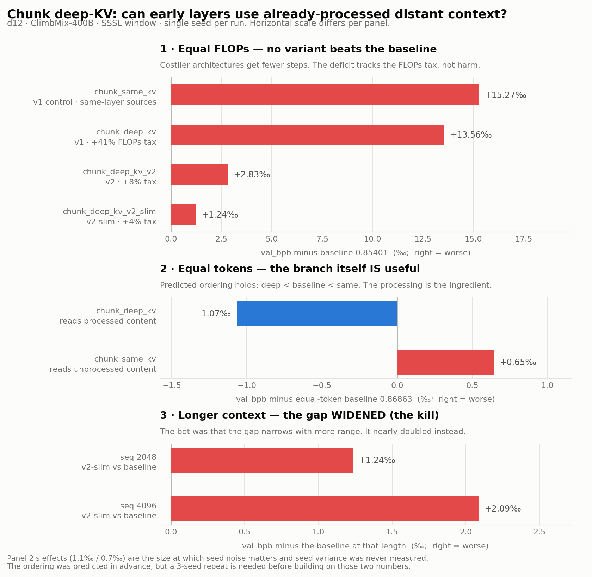

# Chunk deep-KV: can early layers use *already-processed* distant context?

**Status: closed (negative at equal FLOPs).** The hypothesis was confirmed but the
effect is ~1‰ and the mechanism costs more than it returns. This document records
what was built, what was measured, and why the line was stopped, so the result is
reusable rather than repeated.

---

## 1. The question

In a standard transformer, layer `L` of token `i` reads layer `L-1` of token `j<i`.
The wiring is always *horizontal*: same depth talking to same depth. So an early
layer can only ever see a **raw** version of a distant token — a version that has
had almost no computation applied to it. There is no edge in the graph from
"token j's deep state" to "token i's shallow layer".

That is not a modelling choice, it is a training constraint: token `j`'s layer-11
state does not exist until the whole forward pass is done, and during training all
positions are computed at once. This is where Feedback Transformer (2002.09402)
got stuck.

Our causal measurements (`research/patchscope` branch) show the consequence:
**distant reading happens late.** On Qwen3-8B the subject-token interchange
recovery stays ~0.9 through L0–22 and falls off a cliff at L23; d24 breaks at
~L16, d12 at ~L10. Roughly the last third of the network is causally spent as far
as reading a token's context is concerned. A plausible reading is that the model
declines to read early *because what is readable early is not worth reading*, and
pays for it by reserving deep capacity for long-range work.

**Hypothesis.** If we hand early layers the already-processed states of earlier
text, distant reading moves earlier, depth stops being spent on it, and quality
improves at equal FLOPs.

---

## 2. The mechanism

Cut the sequence into chunks of `chunk_size` (256). Give the **early** layers
(the first `chunk_kv_frac` of layers) one extra attention branch whose keys and
values come from **strictly earlier chunks**. Chunk-internal computation is
unchanged, so training parallelism inside a chunk is untouched, and the sources
are detached (Transformer-XL style truncation) so no gradient crosses chunks.

Two things make it a controlled experiment rather than a hack:

- **The branch adds no new matrices.** Keys/values are projected with the layer's
  own `c_k`/`c_v`. So a win cannot be attributed to extra parameters.
- **The gates start at exactly 0.** At step 0 the model is bit-for-bit the
  baseline (`tests/test_chunk_deep_kv.py::test_parity_at_zero_gate`). The branch
  has to earn its way in.

### The control that makes the result interpretable

`chunk_same_kv` is identical in every respect except **where the branch reads
from**: previous chunks' *same-layer* states instead of their *final-layer*
states. It therefore grants exactly the same extra **visibility** while carrying
none of the extra **processing**. Without this control, any gain could just be
"the early layers can see further now", which is a much less interesting claim.

### v1 vs v2: paying for the sources

| | how sources are produced | training FLOPs vs baseline |
|---|---|---|
| **v1** | a separate no-grad pass-1 forward over the whole sequence | **1.414×** |
| **v2** | single-pass chunk-recurrent trunk: chunks go through all layers in order, each finished chunk banks its final states for later chunks | **1.081×** |
| **v2-slim** | v2 with 2 branch layers instead of 4 | **1.040×** |

v2's trunk keeps full gradient flow over previous chunks' same-layer KV, so it is
*mathematically equivalent* to the standard trunk — verified bit-exact at gate=0,
which is what makes the equal-FLOPs comparison fair. Ratios above are
`estimate_flops()` at d12 shape and are asserted in the tests.

---

## 3. Code

Everything lives on this branch (`research/chunk-deep-kv`); `master` is untouched.

| file | what it holds |
|---|---|
| `nanochat/model/gpt_base.py` | config fields, per-head gate, the v1 and v2 attention branches, both trunk paths, FLOPs accounting |
| `nanochat/model_registry.py` | the four `gpt_base_chunk_*` model types |
| `scripts/run_chunk_deep_kv.sh` | launcher (waits for idle GPUs, idempotent) |
| `tests/test_chunk_deep_kv.py` | parity / gradient / causality / FLOPs tests |

```bash
python -m pytest tests/test_chunk_deep_kv.py -v     # 10 tests, needs 1 GPU, ~10s
scripts/run_chunk_deep_kv.sh baseline               # then: deep_kv same_kv v2 v2_slim equaltoken
```

### Reading the model code

`GPTBase.forward` has three trunk paths — plain, v2 (`chunk_recurrent`), v1
(two-pass). `CausalSelfAttention.forward` has the two branch implementations. Both
merge through `chunk_gate` (one scalar per head, init 0). The gate is 1-D so it is
deliberately kept out of the Muon matrix group and given AdamW with no weight
decay, so a useful branch is free to grow away from zero.

---

## 4. Data

Pretraining corpus is unchanged from nanochat master — no custom data was built
for this experiment.

- **Dataset:** ClimbMix-400B (shuffled), `karpathy/climbmix-400b-shuffle` on HF.
- **On this machine:** `/local-ssd/mh3897/base_data_climbmix`, 1926 parquet
  shards, 165 GB. Set `NANOCHAT_BASE_DIR=/local-ssd/mh3897`.
- **To fetch elsewhere:** `python -m nanochat.dataset -n 170` (170 shards is
  enough for the d12 runs here).
- **Split:** the last shard is validation, all others train (`nanochat/dataset.py`).
- **Tokenizer:** 32768 vocab, trained on ClimbMix (`scripts/tok_train.py`).
- **Packing:** BOS-aligned best-fit, so every row starts at a document boundary.
  Costs ~35% of tokens to cropping at T=2048 but avoids cross-document confusion.
- **Metric:** `val_bpb`, bits per byte on the held-out shard. Byte-normalised, so
  it is comparable across tokenizers. Lower is better. Differences discussed here
  are in the 1–20‰ range; read the honesty note in §6 before trusting small gaps.

---

## 5. Models trained and results



*Regenerate with `python -m scripts.plot_chunk_deep_kv` (reads the checkpoint
metadata, so the figure cannot drift from the runs; `--hardcoded` falls back to
the values in the tables below).*


All runs: **d12** (12 layers, 768 dim, 6 heads), sequence 2048 unless noted,
`SSSL` sliding-window pattern, ClimbMix, single seed. Budgets are **equal FLOPs**
at 1.5e18 — `base_train` converts the budget into a step count via
`estimate_flops()`, so a more expensive architecture is given proportionally
*fewer steps*. That is the honest comparison and it is what the branch has to beat.

### 5a. Main equal-FLOPs comparison (seq 2048)

| model | what it is | steps | val_bpb | vs baseline |
|---|---|---|---|---|
| `gpt_base` | **baseline**: unmodified nanochat GPT-2-style model, no branch | 3766 | **0.85401** | — |
| `..._chunk_deep_kv` | v1, branch reads previous chunks' final-layer states | 2663 | 0.86757 | +13.6‰ |
| `..._chunk_same_kv` | v1 **control**, branch reads previous chunks' same-layer states | 2663 | 0.86928 | +15.3‰ |
| `..._chunk_deep_kv_v2` | v2, single-pass chunk-recurrent (tax 41%→8%) | 3485 | 0.85684 | +2.8‰ |
| `..._chunk_deep_kv_v2_slim` | v2 with 2 branch layers instead of 4 | 3620 | **0.85524** | +1.2‰ |

Every variant loses at equal FLOPs. But the loss shrinks exactly as the *cost*
shrinks (41% → 8% → 4% tax; 13.6‰ → 2.8‰ → 1.2‰), which says the deficit is
paid for by the tax, not by the branch being harmful. §5b tests that directly.

### 5b. The control experiment — is the branch itself useful?

Hold **tokens** fixed instead of FLOPs (all three at ~2663 steps), which isolates
the branch's per-token effect from what it costs:

| model | val_bpb | reading |
|---|---|---|
| `..._chunk_deep_kv` | **0.86757** | branch ON, reads processed content |
| `gpt_base` (equal-token) | 0.86863 | no branch |
| `..._chunk_same_kv` | 0.86928 | branch ON, reads unprocessed content |

**deep < baseline < same** — the predicted ordering, exactly.

- Branch is beneficial per token: **−1.1‰** vs no branch.
- The benefit is specifically from **processed** content: **−1.7‰** vs the
  same-layer control. Extra visibility alone is slightly *harmful*.

So the scientific hypothesis is supported. What kills it is the exchange rate: a
~1‰ gain against an 8% FLOPs bill.

(The equal-token baseline was actually run at `--target-flops=1.06e18`, landing on
2661 steps vs deep_kv's 2663 — a 0.08% mismatch. `run_chunk_deep_kv.sh equaltoken`
now pins `--num-iterations` directly.)

### 5c. The decisive test — does the benefit grow with context length?

The whole case for continuing rested on this: long-range reading should be worth
more when there is more range, while the branch's cost share stays fixed. So the
gap should *narrow* at 4096.

| seq | baseline | v2-slim | gap |
|---|---|---|---|
| 2048 | 0.85401 | 0.85524 | +1.2‰ |
| 4096 | 0.86086 | 0.86295 | **+2.1‰** |

It went the wrong way. The branch's attention cost also scales with length (each
early layer compares against *all* previous chunks), so cost grew at least as fast
as any benefit. Per the pre-registered kill rule, the line was closed here.

---

## 6. Honesty notes

- **Single seed everywhere.** The §5b effects (1.1‰ and 1.7‰) are the size at
  which seed noise matters and we did not measure seed variance. The ordering was
  predicted in advance and came out right, which is worth something, but nobody
  should build on these two numbers without a 3-seed repeat.
- **The §5a and §5c losses are large enough to trust** (2–14‰, and §5c is the
  wrong-direction result that mattered).
- **Only d12, only 2048/4096, only bpb.** It is entirely possible early layers
  need more capacity than d12 has to exploit distant processed states. We have no
  evidence either way and chose not to spend compute finding out.
- **bpb is an average over all tokens** and long-range reading affects a small
  minority of them, so this metric dilutes exactly the effect we were chasing. If
  this line is ever revived, the first change should be a long-range retrieval
  eval, not another architecture variant.
- **Generation path is a prototype.** `kv_cache` inference skips the branch
  (asserted by the code path, not silently). All reported numbers come from the
  training/eval path, which does use it.

## 7. What survives

1. **Early layers *can* use processed distant content** — +1.1‰/token, and the
   same-layer control shows it is the processing, not the visibility.
2. **v2's chunk-recurrent trunk** is a reusable piece: a single-pass,
   bit-exactly-equivalent way to run a chunked trunk with cross-chunk state
   available, at ~8% overhead. Any future mechanism needing "previous chunks'
   deep states during training" can start from it.
3. **The negative result itself**: the Feedback-Transformer intuition survives
   contact with a controlled experiment, but at d12/2048–4096 scale on bpb the
   effect does not pay for its wiring.

## 8. Related work this was positioned against

- **LCKV** (2405.10637) — all layers' queries read the *top* layer's KV, trained
  with a truncated iterative approximation. Replaces rather than augments;
  motivated by KV memory; quality parity, not gain.
- **Systematic study** (2410.14442) — swept which layer reads which; found middle
  layers best, empirically.
- **Recurrent Transformer** (2604.21215) — token `i` layer `ℓ` reads token `j<i`
  layer `ℓ` (exact 1-layer shift) with IO-aware tiling.
- **Feedback Transformer** (2002.09402) — the origin of the idea; parallel
  training never solved.
- **Transformer-XL** — cross-chunk truncation, but same-layer sources.
